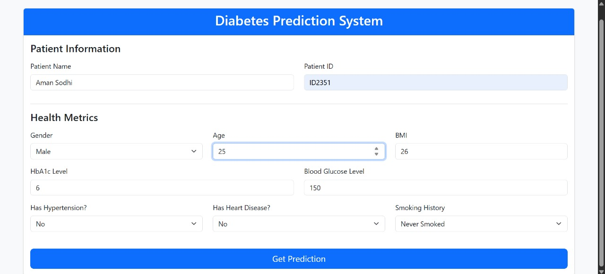
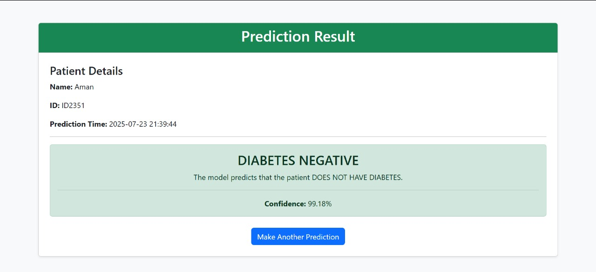

# Diabetes Prediction System


## 🚀 Project Overview
The **Diabetes Prediction System** is a web application built with Flask and Python that predicts whether a patient has diabetes based on key health metrics. It bundles multiple pre-trained machine-learning models and presents a clean, responsive interface for rapid, high-confidence diagnoses.

## 🔍 Key Features
- **Interactive Web UI**  
- **Multiple ML Models** (Logistic Regression, K-Nearest Neighbors, Gradient Boosting)  
- **Probability / Confidence Scores**  
- **Lightweight & Easily Deployable**  

## 📸 Demo (Optional)

| Input Form | Prediction Result |
|:----------:|:-----------------:|
|  |  |

## 🛠️ Tech Stack
- **Language:** Python 3.x  
- **Web Framework:** Flask  
- **Frontend:** HTML5, Bootstrap  
- **ML:** scikit-learn, pandas, numpy  
- **Model Persistence:** joblib  

## ⚙️ Installation & Setup
1. **Clone the repo**  
   ```bash
   git clone https://github.com/your-username/Diabetes_Prediction_System.git
   cd Diabetes_Prediction_System

2. **Create & activate a virtual environment**  
   ```bash
   python3 -m venv venv
   source venv/bin/activate      # Windows: venv\Scripts\activate

3. **Install dependencies**  
   ```bash
   pip install -r requirements.txt

4. **Run the app**  
   ```bash
   python app.py

5. **Visit** `http://localhost:5000` in your browser.

## 🚦 Usage
1. Enter **Patient Name & ID**.  
2. Fill in **Gender**, **Age**, **BMI**, **HbA1c**, **Blood Glucose**, **Hypertension**, **Heart Disease**, **Smoking History**.  
3. Click **Get Prediction**.  
4. View **DIABETES POSITIVE/NEGATIVE** and **Confidence**.

## 📈 Model Details
- **Logistic Regression**: baseline linear model  
- **K-Nearest Neighbors**: distance-based classifier  
- **Gradient Boosting**: ensemble tree model (highest accuracy)

> _Tip:_ update the accuracy/AUC numbers here after you evaluate on your validation set.

## 🤝 Contributing
1. Fork & clone  
2. Create a branch:  
   ```bash
   git checkout -b feature/YourFeature
3. Commit & push
4. Open a Pull Request

## 📄 License
Distributed under the [MIT License](LICENSE).

---

*Built with ❤ by Sneha Tanwar*
